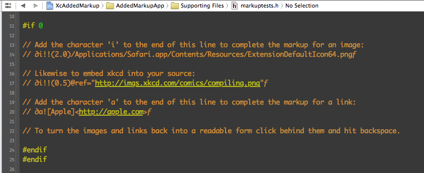
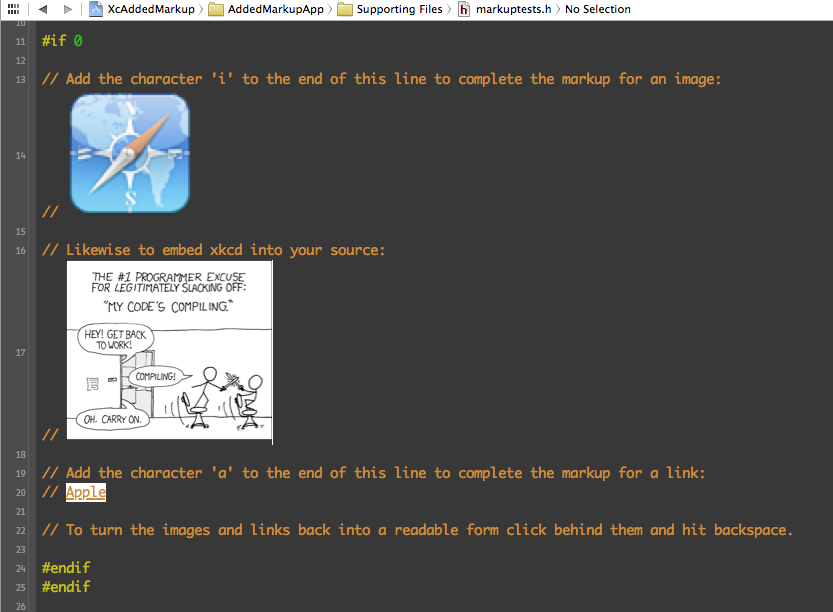
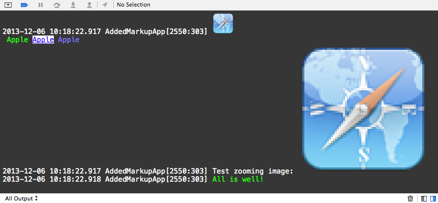
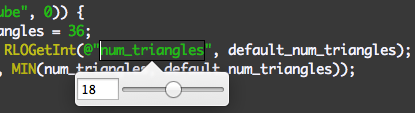

XcAddedMarkup is an Xcode plugin that adds a custom markup for hyperlinks and images inside the Xcode console and the Xcode source editor. It builds on the plugin XcodeColors which supports colored text.

## What does it look like

First a screenshot of some markup with the last character still missing followed by a screenshot where the markup tags were completed.
A third screenshot shows the Xcode console where I have found this plugin to be most useful for logging images into the console.

<p align="center" >
  
</p>

<p align="center" >
  
</p>

<p align="center" >
  
</p>

Images begin with ∂i and end with ƒi.
Links begin with ∂a and end with ƒa.
You find ∂ via alt-d and ƒ via alt-f on your Mac keyboard. 

In both cases as soon as the markup is recognized it is replaced by its graphical representation. So if you are editing this in Xcode it is best to get everything correct and then add the final character which closes the markup.

## Examples

```
∂i!!(2.0, 2.0, 0)/Applications/Safari.app/Contents/Resources/ExtensionDefaultIcon64.pngƒi

∂i!!(0.5)@ref="http://imgs.xkcd.com/comics/compiling.png"ƒi

∂a![Apple]<http://apple.com>ƒa
```

Without exclamation marks the markup used to display the image or link is shown as well. Adding two exclamation marks for an image or one exclamation mark for a link suppresses this "view source" default mode.

A single number in parentheses after the image tag ∂i specifies the zoom level. Three numbers specify zoomx, zoomy and interpolation. Use 0 as third parameter to get a pixelated zoom without smoothing.


## How To Get Started

Download XcAddedMarkup and open the Xcode project.
Select the target XcAddedMarkup and build the project.
After a successful build the plugin is installed in:

`~/Library/Application Support/Developer/Shared/Xcode/Plug-ins`

Please note this location. If Xcode crashes more often than usual please delete `XcAddedMarkup.xcplugin` to restore things to normal.

Restarting Xcode after the build should be enough to enable the plugin, here are some commands to disable specific or all parts of the markup recognition.

```
defaults write com.apple.dt.Xcode XcAddedMarkupPluginDisabled -bool yes
defaults write com.apple.dt.Xcode XcAddedMarkupFixDisabled -bool yes
defaults write com.apple.dt.Xcode XcAddedMarkupImagesDisabled -bool yes
defaults write com.apple.dt.Xcode XcAddedMarkupLinksDisabled -bool yes
defaults write com.apple.dt.Xcode XcAddedMarkupAnsiColorsDisabled -bool yes
defaults write com.apple.dt.Xcode XcAddedMarkupEmbeddedControlsDisabled -bool yes
defaults write com.apple.dt.Xcode XcAddedMarkupCustomLinkBackgroundDisabled -bool yes
```
## RestartLessOften

In addition to links and image XcAddedMarkup also support [RestartLessOften](https://github.com/mikr/RestartLessOften) in that certain macro calls are recognized in the source code and a slider and text field are offered to tweak a parameter during application runtime.

<p align="center" >
  
</p>


## Requirements

Xcode 5 or 6. Although XcAddedMarkup ran fine with Xcode 4, I am no longer testing with older versions of Xcode.


## Usage

XcAddedMarkup specifies a textual markup but no API how to emit links and images, please look in AppDelegate.m of the AddedMarkupApp how to define some macros that wrap these things nicely. Also AddedMarkupApp can be used for testing the markup recognition without having to reinstall the plugin and restarting Xcode over and over again.


## Credits

XcAddedMarkup was written by [Michael Krause](http://krause-software.com).

XcAddedMarkup markup parsing was based on [XcodeColors](
https://github.com/robbiehanson/XcodeColors) by Robbie Hanson, the plugin structure is taken from [ColorSense-for-Xcode](https://github.com/omz/ColorSense-for-Xcode) by Ole Zorn.

## License

XcAddedMarkup is available under the MIT license. See the LICENSE file for more info.
